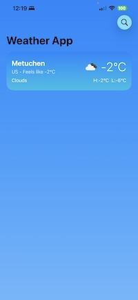
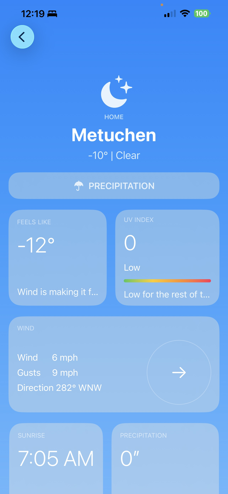

# ChaseWeather 🌦️

ChaseWeather is a modern iOS weather application built using **SwiftUI** and structured with **MVVM + Coordinator architecture**.  
The app allows users to search for any city and view real-time weather details in a clean and intuitive interface.

---

## Screenshots

## Setup 

### Secrets & API Configuration (using .xcconfig)

This project uses ⁠ .xcconfig ⁠ files to securely manage API keys, base URLs, and other sensitive values — *never* hardcode secrets in source code.

### Step-by-step Setup

1.⁠ ⁠*Locate the sample file*  
   In the project navigator, find:  
   ⁠ Resources/Sample.Secrets.xcconfig ⁠ (or ⁠ Sample.Secrets.xcconfig ⁠ in the root / Secrets folder)

2.⁠ ⁠*Create your personal secrets file*  
   - Right-click the sample file → *Duplicate*  
   - Rename the duplicate to: *⁠ Secret.xcconfig ⁠*  
   - *Important: Do **not* commit ⁠ secret.xcconfig ⁠ to version control

## 🚀 Features

- 🌍 Search weather by city name
- 🌡️ Displays temperature, humidity, and weather condition
- 🔄 Real-time API data fetching
- 🧭 Coordinator-based navigation
- 🧱 Scalable architecture for large applications
- 🎨 Clean SwiftUI user interface

---

## 🏗️ Architecture

This project follows **MVVM (Model–View–ViewModel)** combined with the **Coordinator pattern** for better separation of concerns and navigation handling.

### 🔹 MVVM Responsibilities

| Layer | Responsibility |
|------|----------------|
| **Model** | Data structures & API response models |
| **View** | UI components written in SwiftUI |
| **ViewModel** | Business logic, state management, API calls |

### 🔹 Coordinator Responsibilities

- Handles app navigation flow
- Keeps navigation logic out of Views
- Makes the app easier to scale and test

## API
Weather data is fetched from OpenWeather API.

## Author
Aakash Tandukar  
Senior iOS Developer

